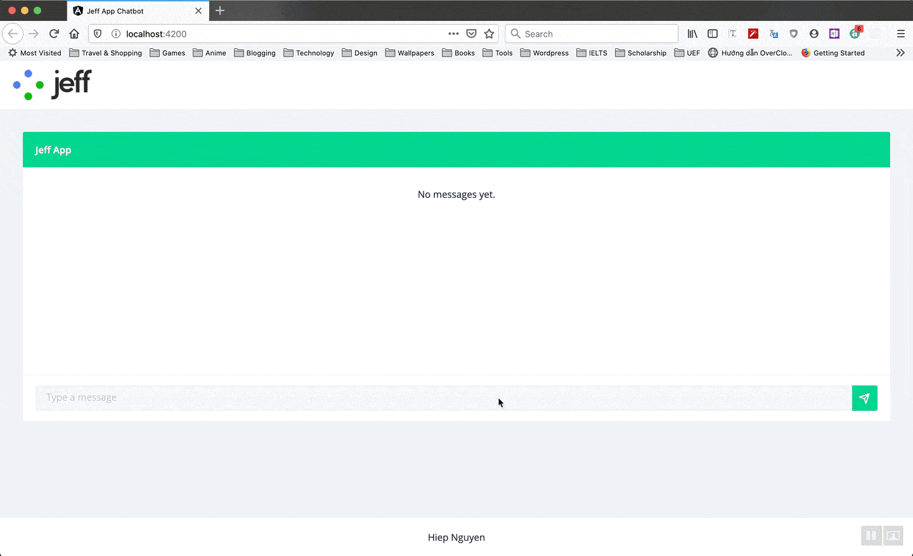

# jeff-app-chatbot
Jeff App Chatbot made with Spring Boot, Dialogflow, Websocket and Angular 9.



## Running the chatbot Application

First setup authentication

```cmd
set GOOGLE_APPLICATION_CREDENTIALS=/path-to-chatbot/src/main/resources/jeff-app-chatbot-htsnrj-49c34902154e.json
```

Import the chatbot project to the IDE of your choosing as a Maven project.

Run the application using `mvn spring-boot:run` or by running the `Application` class directly from your IDE.

Open http://localhost:8080/ in your browser.

If you want to run the application locally in the production mode, run `mvn spring-boot:run -Pproduction`.

## Running the angular-chat Application

Navigate to angular-chatbot directory.

Run `npm i` to install the required libraries.
Run `ng serve` for a dev server.

Navigate to http://localhost:4200/ in your browser..

The browser will automatically reload if you change any of the source files.
